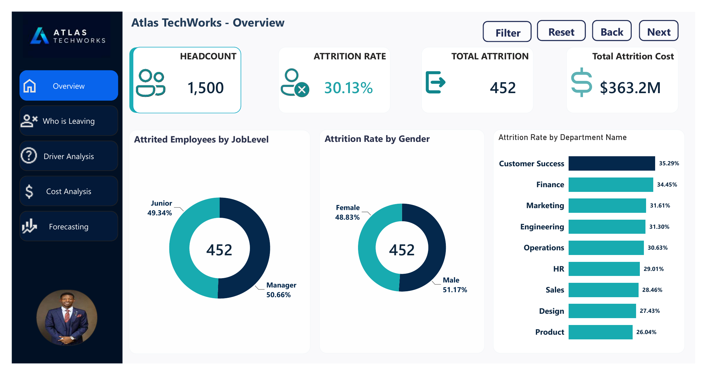
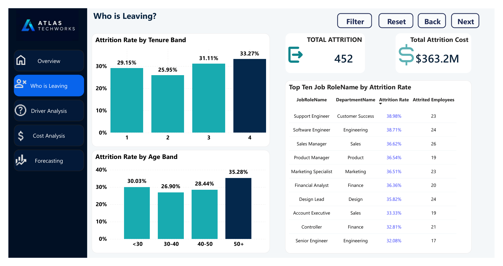
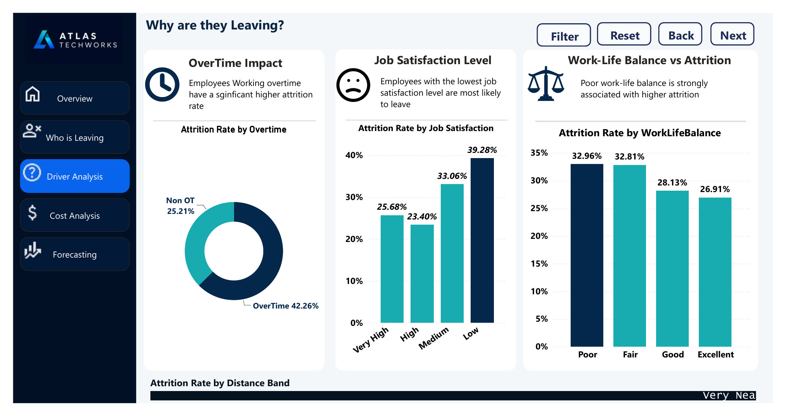
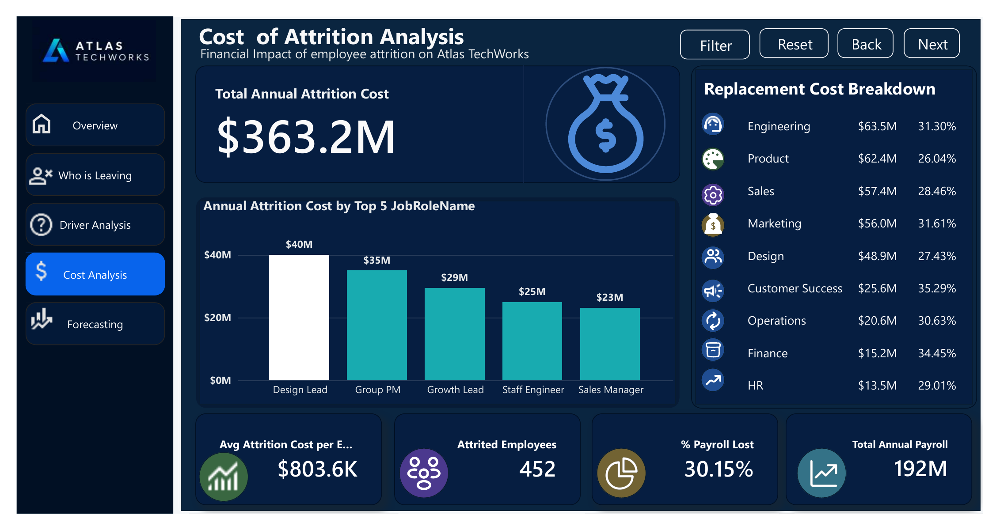
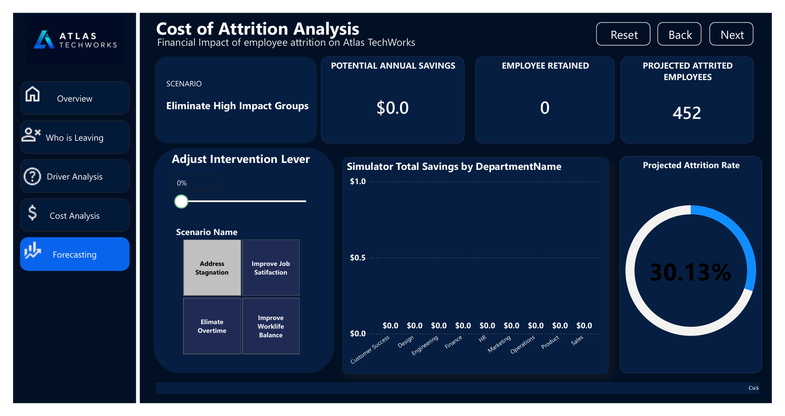

# Workforce Attrition Analytics Dashboard
 
**Human Resources Analytics Project — Advanced Workforce Analytics & Attrition Cost Modelling**
 
Prepared by: **Joshua Boluwatife Adelusi**
Institution: **StarTechOne Nigeria Limited**
Tool: **Power BI Desktop**
Date: June 2026
 
---
 
## 📌 Project Overview
 
Atlas TechWorks is a 1,500-employee technology company experiencing rising voluntary employee attrition across several departments, job levels, and employee groups. High turnover disrupts productivity and team stability, while also driving up recruitment, onboarding, and replacement costs.
 
This project analyzes workforce data using **Power BI** to uncover the key drivers of employee attrition, quantify the financial impact of departures, and identify the employee segments most at risk of leaving — enabling data-driven, high-ROI retention decisions.
 
---
 
## 🎯 Aims & Objectives
 
**Aim:** Analyze employee attrition at Atlas TechWorks to identify attrition patterns, determine key drivers of turnover, quantify the financial impact, and recommend data-driven retention strategies.
 
**Objectives:**
- Determine the overall attrition rate and how it varies by department, job role, age group, tenure band, and job level
- Identify key drivers of attrition — overtime, job satisfaction, work-life balance, distance from home, and compensation
- Evaluate the relationship between promotion stagnation and attrition, especially at lower job levels
- Estimate the annual financial cost of attrition using salary and replacement cost assumptions
- Identify the departments and employee groups contributing most to attrition-related costs
- Build interactive Power BI dashboards visualizing attrition trends, drivers, and costs
- Model retention scenarios and estimate potential cost savings from targeted interventions
- Deliver actionable recommendations to support workforce planning and long-term retention
---
 
## 🗂 Dashboard Structure
 
The report is built as a multi-page interactive Power BI dashboard with the following sections:
 
| Page | Description |
|------|-------------|
| **Overview** | Headline KPIs — headcount, attrition rate, total attrition, and total attrition cost |
| **Who is Leaving** | Breakdown of attrition by job level, gender, department, tenure band, age band, and job role |
| **Driver Analysis** | Key drivers of attrition — overtime, job satisfaction, work-life balance, and distance from home |
| **Cost Analysis** | Financial impact of attrition by role and department, including payroll and replacement cost breakdowns |
| **Forecasting** | Interactive "what-if" simulator to model retention interventions and projected savings |
| **Insights & Recommendation** | Summary of key findings and actionable retention strategies |
 
---
 
## 📊 Key Metrics (KPIs)
 
| Metric | Value |
|--------|-------|
| Headcount | 1,500 |
| Attrition Rate | 30.13% |
| Total Attrition | 452 employees |
| Total Annual Attrition Cost | $363.2M |
| Avg. Cost per Employee Lost | $803.6K |
| % of Payroll Lost | 30.15% |
| Total Annual Payroll | $192M |
 
---
 
## 🔍 Key Findings
 
**Who is Leaving**
- Attrition is nearly evenly split between managers (50.66%) and junior employees (49.34%)
- Male employees show a slightly higher attrition rate (51.17%) than female employees (48.83%)
- **Customer Success (35.29%)** and **Finance (34.45%)** have the highest departmental attrition rates
- Employees with **10+ years of tenure (32.27%)** and those **aged 50+ (35.28%)** show the highest attrition
- **Support Engineers (38.98%)** and **Software Engineers (38.71%)** are the most vulnerable job roles
**Why They're Leaving**
- **Overtime** is the strongest driver — 42.26% attrition among overtime workers vs. 25.21% for non-overtime
- **Low job satisfaction** correlates with 39.28% attrition vs. 23.40% for highly satisfied employees
- **Poor work-life balance** shows a consistent (though smaller) link to higher attrition
**Financial Impact**
- **Design Lead** is the most expensive role to replace (~$40M annually)
- **Engineering, Product, and Sales** carry the largest total attrition cost exposure, despite not having the highest attrition *rates*
- Customer Success has the highest attrition rate but a comparatively lower total cost impact due to salary structure differences
---
 
## 💡 Recommendations
 
1. **Manage overtime carefully** to reduce burnout-driven attrition
2. **Strengthen job satisfaction and work-life balance programs** across the organization
3. **Prioritize retention support** for Customer Success (highest attrition rate) and Engineering, Product, and Sales (highest cost exposure)
4. **Protect critical technical roles** — Support Engineers and Software Engineers — from turnover-driven operational risk
5. **Review promotion pathways** to address career stagnation among long-tenured employees
6. **Use the built-in attrition simulator** to evaluate intervention scenarios before committing resources
7. **Continuously monitor** the dashboard to track the impact of retention initiatives over time
---
 
## 🛠 Tools & Skills Used
 
- **Power BI Desktop** — data modeling, DAX measures, interactive visuals
- **DAX** — KPI calculations (attrition rate, cost modeling, simulator logic)
- **Data Visualization** — donut charts, bar charts, tables, KPI cards
- **What-If Analysis** — intervention scenario simulator with adjustable parameters
- **Workforce Analytics** — demographic and behavioral driver analysis
---
 
## 📁 Repository Contents
```
├── HR_Attrition.xlsx               # Dataset in Excel File
├── HR_Attrition_Dashboard.pbix     # Power BI source file
├── HR_Attrition_Dashboard.pdf      # Exported PDF walkthrough of the dashboard
├── 01-overview.png                 # Dashboard screenshot — Overview
├── 02-who-is-leaving.png           # Dashboard screenshot — Who is Leaving
├── 03-driver-analysis.png          # Dashboard screenshot — Driver Analysis
├── 04-cost-analysis.png            # Dashboard screenshot — Cost Analysis
├── 05-forecasting-simulator.png    # Dashboard screenshot — Forecasting Simulator
└── README.md                       # Project documentation 
```
 
 
## 📷 Dashboard Preview
 
### Overview

 
### Who is Leaving

 
### Driver Analysis

 
### Cost Analysis

 
### Forecasting Simulator

 
---
 
## 📬 Contact
 
**Joshua Boluwatife Adelusi**
StarTechOne Nigeria Limited
 
*Data. Insights. People. Performance.*
